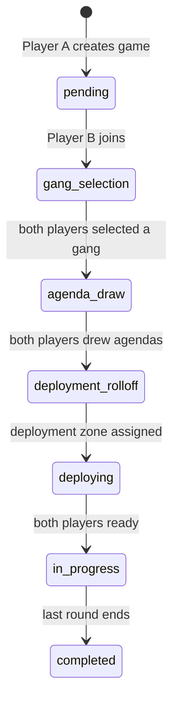

# Two-Player Game Setup Flow

Status: **draft — for iteration before implementation**

This document maps Carnevale's tabletop "Order of Play → Setup" (rulebook p.33-37) onto
the digital companion app described in [ARCHITECTURE.md](ARCHITECTURE.md#game-session).
It covers **only** game creation and setup — from Player A hitting "create game" up to
the moment both gangs are deployed and Round 1 is about to begin. In-round play
(activations, AP spend, HP/Will/CP tracking) is out of scope here.

Scope is fixed at **2 players**, even though the rulebook supports 2-4.

---

## Actors

| Actor | Role |
|---|---|
| Player A | Host — creates the game, picks the scenario |
| Player B | Guest — joins via a code shared by A |
| Server | Rails backend — REST for actions, ActionCable for broadcasts |

---

## Rulebook reference: Setup (p.37)

1. **Scenario** — choose the scenario, and attacker/defender if relevant.
2. **Gang** — choose gang (list) within the scenario's Ducat limit, including Magic Spells.
3. **Scenery** — place terrain. *(physical table action, not app-mediated)*
4. **Objectives** — place objectives, draw Agendas.
5. **Deploy** — roll-off (1 die, re-roll ties); winner picks a Deployment Zone and
   deploys first, then next-highest, etc., until all gangs are deployed. Then players
   roll for initiative to start Round 1.

All dice rolls in this flow (role roll-off, deployment roll-off, and later initiative)
are **rolled by the app** — server-generated random, broadcast to both players. This
removes disputes and keeps the flow fully digital; there's no "report a physical roll"
path.

Scenario examples read from the rulebook (p.39-43), useful as seed data for a
`Scenario` catalog — each fixes a **default** Ducat limit, board size, deployment
zone shape, and duration:

| Scenario | Default Ducats | Board | Deployment | Duration | Notes |
|---|---|---|---|---|---|
| Gang War | 150 | 3'x3' | opposite edges, 8" | 5 rounds | symmetric |
| Secure Arms | 100 | 3'x3' | opposite edges, 8"/12" | 5 rounds | symmetric |
| Acquisition | 75 | 2'x2' | opposite corners | 5 rounds | symmetric, no Leader required |
| Take What is Theirs | 150 | 3'x3' | opposite corners | 8 rounds | symmetric |
| Street Fight | 100 | 2'x4' | one edge each | 7 rounds | **asymmetric — Attacker/Defender roles** |

The rulebook explicitly frames these as *recommendations* ("feel free to adjust the
limit to suit your games"). So in the app, picking a scenario **pre-fills** the game's
Ducat limit from that scenario's default, but Player A can override it with a manual
value before creating the game. The stored `ducat_limit` on the `Game` is always the
effective one — there's no separate "scenario default" vs "override" field to reconcile
later, just whatever value was submitted (defaulted or overridden) at creation time.

Street Fight (and any future asymmetric scenario) breaks the "symmetric roll-off"
assumption below — for these scenarios, once **both** players have joined, the app
runs a role roll-off (same digital-dice mechanism as the deployment roll-off) and the
winner picks Attacker or Defender; the other player takes the remaining role. This
does not happen at creation time, since Player B isn't in the game yet.

---

## Sequence diagram

```mermaid
sequenceDiagram
    actor A as Player A (Host)
    participant S as Server (REST + ActionCable)
    actor B as Player B (Guest)

    Note over A,B: Create & Join
    Note over A: ducat_limit defaults from the chosen scenario, A may override it
    A->>S: POST /games { scenario_id, ducat_limit?, board_size }
    S-->>A: 201 { game_id, join_code, status: "pending" }
    A->>S: subscribe GameChannel(join_code)

    Note over A: shares join_code with B (out of band)

    B->>S: POST /games/join { join_code }
    S-->>B: 200 { game_id, status: "gang_selection" }
    B->>S: subscribe GameChannel(join_code)
    S--)A: broadcast player_joined { player: B }
    S--)B: broadcast game_state { scenario, players: [A, B] }

    opt scenario is asymmetric (e.g. Street Fight)
        Note over A,B: Role roll-off — now that both players are in
        par A rolls
            A->>S: POST /games/:id/role_roll
            S--)A: broadcast role_roll_result { player: A, roll }
            S--)B: broadcast role_roll_result { player: A, roll }
        and B rolls
            B->>S: POST /games/:id/role_roll
            S--)A: broadcast role_roll_result { player: B, roll }
            S--)B: broadcast role_roll_result { player: B, roll }
        end
        Note over S: ties are re-rolled automatically
        alt A won the role roll-off
            A->>S: PATCH /games/:id/role { role: "attacker" }
        else B won the role roll-off
            B->>S: PATCH /games/:id/role { role: "attacker" }
        end
        S--)A: broadcast roles_assigned { A: "attacker", B: "defender" }
        S--)B: broadcast roles_assigned { A: "attacker", B: "defender" }
    end

    Note over A,B: Rulebook Step 2 — Gang selection
    A->>S: GET /games/:id/available_lists
    S-->>A: 200 [{ list, selectable: true/false }] (false if list.points > ducat_limit)
    B->>S: GET /games/:id/available_lists
    S-->>B: 200 [{ list, selectable: true/false }]
    par A selects gang
        A->>S: PATCH /games/:id/select_gang { list_id }
        S--)A: broadcast gang_selected { player: A, list }
        S--)B: broadcast gang_selected { player: A, list }
    and B selects gang
        B->>S: PATCH /games/:id/select_gang { list_id }
        S--)A: broadcast gang_selected { player: B, list }
        S--)B: broadcast gang_selected { player: B, list }
    end
    Note over A,B: Both gangs become visible to both players
    S--)A: broadcast game_state { status: "agenda_draw" }
    S--)B: broadcast game_state { status: "agenda_draw" }

    Note over A,B: Rulebook Step 3 — Scenery (physical, no app interaction)

    Note over A,B: Rulebook Step 4 — Objectives & Agendas
    par A draws agendas
        A->>S: POST /games/:id/agendas/draw
        S-->>A: 200 { agendas } (private to A)
    and B draws agendas
        B->>S: POST /games/:id/agendas/draw
        S-->>B: 200 { agendas } (private to B)
    end
    S--)A: broadcast game_state { status: "deployment_rolloff" }
    S--)B: broadcast game_state { status: "deployment_rolloff" }

    Note over A,B: Rulebook Step 5 — Deploy
    par A rolls
        A->>S: POST /games/:id/deployment_roll
        S--)A: broadcast deployment_roll_result { player: A, roll }
        S--)B: broadcast deployment_roll_result { player: A, roll }
    and B rolls
        B->>S: POST /games/:id/deployment_roll
        S--)A: broadcast deployment_roll_result { player: B, roll }
        S--)B: broadcast deployment_roll_result { player: B, roll }
    end
    Note over S: ties are re-rolled automatically, server-side
    S--)A: broadcast deployment_winner { player }
    S--)B: broadcast deployment_winner { player }

    alt A won the roll-off
        A->>S: PATCH /games/:id/deployment_zone { zone: "north" }
    else B won the roll-off
        B->>S: PATCH /games/:id/deployment_zone { zone: "north" }
    end
    S--)A: broadcast deployment_zone_assigned { A: "north", B: "south" }
    S--)B: broadcast deployment_zone_assigned { A: "north", B: "south" }

    Note over A,B: Players physically place miniatures at the table
    par
        A->>S: POST /games/:id/ready
    and
        B->>S: POST /games/:id/ready
    end
    S--)A: broadcast game_state { status: "in_progress", round: 1 }
    S--)B: broadcast game_state { status: "in_progress", round: 1 }

    Note over A,B: Setup complete — Round 1 initiative roll begins gameplay
```

---

## `Game.status` state machine

---

## Endpoint sketch

| Method | Path | Actor | Purpose |
|---|---|---|---|
| `POST` | `/games` | A | Create game: `scenario_id`, ducat limit (optional — defaults from scenario), board size |
| `POST` | `/games/join` | B | Join via `join_code` |
| `POST` | `/games/:id/role_roll` | A, B | *(asymmetric scenarios only)* Roll for Attacker/Defender priority |
| `PATCH` | `/games/:id/role` | roll-off winner | *(asymmetric scenarios only)* Pick Attacker or Defender |
| `GET` | `/games/:id/available_lists` | A, B | List this player's gangs with a `selectable` flag (`false` when `list.points > ducat_limit`) |
| `PATCH` | `/games/:id/select_gang` | A, B | Attach a `list_id` as this player's gang for the game — rejects (422) if not `selectable` |
| `POST` | `/games/:id/agendas/draw` | A, B | Draw private Agenda cards |
| `POST` | `/games/:id/deployment_roll` | A, B | Roll the 1d6 deployment-priority die |
| `PATCH` | `/games/:id/deployment_zone` | roll-off winner | Pick a Deployment Zone |
| `POST` | `/games/:id/ready` | A, B | Confirm physical deployment done |
| `GET` | `/games/:id` | A, B | Full current game state — used on load and on reconnect |
| WS | `GameChannel` (per `join_code`) | A, B | Receive all `broadcast` events above; sends a full `game_state` snapshot on every `subscribe`, not just deltas |

These are illustrative names, not final — to be settled during implementation.

---

## Reconnection

Fully supported, including switching devices mid-setup: a player is identified by
their authenticated user (JWT), not by a socket or device, so there's no session to
lose. If the app is closed, the connection drops, or the battery dies, the player can
come back — on the same device or a different one — sign in, `GET /games/:id` for a
full snapshot, and `subscribe` to `GameChannel` again. The channel always emits a
complete `game_state` on subscribe (not just the delta since disconnect), so the
client never needs to replay history to catch up. The server being the sole source of
truth (per [ARCHITECTURE.md](ARCHITECTURE.md#source-of-truth)) is what makes this free —
no client-side state needs reconciling beyond "refetch and re-render."

---

## Decisions made

- **Dice rolling** is entirely done by the app (server-generated random), for every
  roll in this flow — role roll-off, deployment roll-off, and later initiative. There
  is no "report a physical roll" path.
- **Asymmetric scenarios (Street Fight, etc.)**: the Attacker/Defender role roll-off
  happens once both players have joined (not at creation, since B isn't present yet).
  See the `opt scenario is asymmetric` block in the sequence diagram.
- **Ducat limit vs. List points**: lists that exceed the game's `ducat_limit` are still
  shown in the selection UI (`GET /games/:id/available_lists`) but flagged
  `selectable: false` and disabled, rather than hidden. `select_gang` still rejects
  (422) a non-selectable list server-side as a backstop.
- **3-4 player support**: explicitly out of scope for now. This doc and its data model
  only need to support 2 players; no need to design `join`/roll-off around a bigger
  lobby yet.
- **Reconnection**: fully supported, including from a different device — see above.
- **Scenario catalog**: a `Scenario` DB table (name, default_ducats, board_size,
  deployment_shape, duration, asymmetric?), seeded from the 5 examples above, rather
  than a hardcoded enum. `Game belongs_to :scenario`. New scenarios (future rulebook
  expansions/campaigns) can then be added via seed data or the backoffice without a
  deploy.

---

## Open Questions

None remaining — ready to move to implementation planning.
