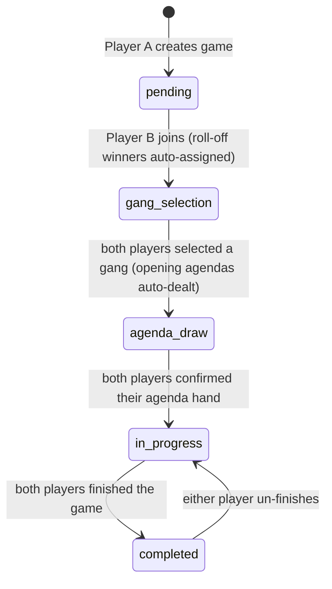

# Two-Player Game Setup Flow

Status: **implemented** — this documents the shipped flow (`Encounter::Game`, `GameChannel`,
`Api::V1::GamesController`). Keep it in sync when that flow changes.

This document maps Carnevale's tabletop "Order of Play → Setup" (rulebook p.33-37) onto
the digital companion app described in [ARCHITECTURE.md](ARCHITECTURE.md#game-session).
It covers **only** game creation and setup — from Player A hitting "create game" up to
the moment the game goes live and Round 1 begins. In-round play (activations, AP spend,
HP/Will/CP tracking, agenda scoring, turn advance, summons) is out of scope here.

Scope is fixed at **2 players**, even though the rulebook supports 2-4.

---

## Actors

| Actor | Role |
|---|---|
| Player A | Host — creates the game, picks the scenario |
| Player B | Guest — joins via a code shared by A |
| Server | Rails backend — REST for actions, ActionCable for broadcasts |

---

## Rulebook reference: Setup (p.37)

1. **Scenario** — choose the scenario, and attacker/defender if relevant.
2. **Gang** — choose gang (list) within the scenario's Ducat limit, including Magic Spells.
3. **Scenery** — place terrain. *(physical table action, not app-mediated)*
4. **Objectives** — place objectives, draw Agendas.
5. **Deploy** — roll-off (1 die, re-roll ties); winner picks a Deployment Zone and
   deploys first, then next-highest, etc., until all gangs are deployed. Then players
   roll for initiative to start Round 1.

The two roll-offs in this flow (the asymmetric attacker/defender roll and the deployment
roll-off) are **decided by the server automatically** — a random winner is chosen the
moment both players are in the game (`Game#assign_roll_winners!`, called from `#join!`),
not through an interactive in-app dice UI, and there is no "report a physical roll" path.
The deployment roll-off winner is stored for reference only; the deployment zones
themselves are agreed at the table, so there is no in-app deployment step. Initiative and
everything else in-round are out of scope for this doc.

Scenario examples read from the rulebook (p.39-43), backing the `Catalog::Scenario`
catalog — each fixes a **default** Ducat limit, board size, deployment zone shape, and
duration:

| Scenario | Default Ducats | Board | Deployment | Duration | Notes |
|---|---|---|---|---|---|
| Gang War | 150 | 3'x3' | opposite edges, 8" | 5 rounds | symmetric |
| Secure Arms | 100 | 3'x3' | opposite edges, 8"/12" | 5 rounds | symmetric |
| Acquisition | 75 | 2'x2' | opposite corners | 5 rounds | symmetric, no Leader required |
| Take What is Theirs | 150 | 3'x3' | opposite corners | 8 rounds | symmetric |
| Street Fight | 100 | 2'x4' | one edge each | 7 rounds | **asymmetric — Attacker/Defender roles** |

The rulebook explicitly frames these as *recommendations* ("feel free to adjust the
limit to suit your games"). So in the app, picking a scenario **pre-fills** the game's
Ducat limit from that scenario's default (`Scenario#ducats`), but Player A can override it
with a manual value before creating the game. The stored `ducat_limit` on the `Game` is
always the effective one — there's no separate "scenario default" vs "override" field to
reconcile later, just whatever value was submitted (defaulted or overridden) at creation.

Street Fight (and any future asymmetric scenario) breaks the symmetric assumption below.
For these scenarios the role roll-off winner is picked server-side at join, and that player
then chooses Attacker or Defender via `PATCH /games/:id/role`; the other player is
auto-assigned the remaining role. This pick must happen **before** gang selection —
`available_lists`/`select_gang` are gated by `ensure_roles_resolved!` until both roles are
set.

---

## Sequence diagram

```mermaid
sequenceDiagram
    actor A as Player A (Host)
    participant S as Server (REST + ActionCable)
    actor B as Player B (Guest)

    Note over A,B: Create & Join
    Note over A: ducat_limit defaults from the chosen scenario, A may override it
    A->>S: POST /games { scenario_id, ducat_limit?, board_size, name? }
    S-->>A: 201 game_state { join_code, status: "pending" }
    A->>S: subscribe GameChannel { game_id }
    S--)A: game_state (full snapshot on subscribe)

    Note over A: shares join_code with B (out of band)

    B->>S: POST /games/join { join_code }
    Note over S: join! adds B, picks roll-off winners, status -> gang_selection
    S-->>B: 200 game_state { status: "gang_selection" }
    B->>S: subscribe GameChannel { game_id }
    S--)A: game_state { player B joined }
    S--)B: game_state (full snapshot)

    opt scenario is asymmetric (e.g. Street Fight)
        Note over A,B: Role roll-off winner was chosen server-side at join
        alt A won the role roll-off
            A->>S: PATCH /games/:id/role { role: "attacker" }
        else B won the role roll-off
            B->>S: PATCH /games/:id/role { role: "attacker" }
        end
        Note over S: the other player is auto-assigned the remaining role
        S--)A: game_state { roles assigned }
        S--)B: game_state { roles assigned }
    end

    Note over A,B: Rulebook Step 2 — Gang selection
    A->>S: GET /games/:id/available_lists
    S-->>A: 200 [{ list, selectable }] (false if list.points > ducat_limit)
    B->>S: GET /games/:id/available_lists
    S-->>B: 200 [{ list, selectable }]
    par A selects gang
        A->>S: PATCH /games/:id/select_gang { list_id }
        S--)A: game_state { A's gang selected }
        S--)B: game_state { A's gang selected }
    and B selects gang
        B->>S: PATCH /games/:id/select_gang { list_id }
        S--)A: game_state { B's gang selected }
        S--)B: game_state { B's gang selected }
    end
    Note over S: both gangs selected -> status agenda_draw, opening hands dealt automatically

    Note over A,B: Rulebook Step 3 — Scenery (physical, no app interaction)

    Note over A,B: Rulebook Step 4 — Objectives & Agendas
    Note over S: each player's opening Agenda hand is dealt automatically on entering agenda_draw
    Note over A,B: each player reviews their private hand (scoped per-player stream)
    opt mulligan an impossible/duplicated agenda (until this player confirms)
        A->>S: POST /games/:id/agendas/:agenda_id/discard { origin: "unachievable" }
        S--)A: game_state { replacement drawn }
    end
    par A confirms hand
        A->>S: POST /games/:id/agendas/confirm
    and B confirms hand
        B->>S: POST /games/:id/agendas/confirm
    end
    Note over S: both confirmed -> start! -> status in_progress, entry states created

    Note over A,B: Rulebook Step 5 — Deploy (physical: zones agreed at the table)
    Note over A,B: deployment roll-off winner shown for reference; no in-app deploy step

    S--)A: game_state { status: "in_progress" }
    S--)B: game_state { status: "in_progress" }

    Note over A,B: Setup complete — Round 1 begins (in-round play out of scope)
```

---

## `Game.status` state machine

`Encounter::Game::STATUSES = %w[pending gang_selection agenda_draw in_progress completed]`.



There is no separate deployment status: the game goes straight from `agenda_draw` to
`in_progress` once both players confirm their hands. `completed` is reversible — it is
derived from the players' per-player `finished` flags (`Game#refresh_completion!`), so one
player finishing never ends the game for the other, and either un-finishing reopens it.

---

## Endpoint sketch (setup scope)

| Method | Path | Actor | Purpose |
|---|---|---|---|
| `POST` | `/games` | A | Create game: `scenario_id`, `ducat_limit` (optional — defaults from scenario), `board_size`, `name` (optional) |
| `POST` | `/games/join` | B | Join via `join_code`; assigns roll-off winners and advances to `gang_selection` |
| `PATCH` | `/games/:id/role` | roll-off winner | *(asymmetric scenarios only)* Pick Attacker or Defender; the other player is auto-assigned the remaining role |
| `GET` | `/games/:id/available_lists` | A, B | This player's gangs, each with a `selectable` flag (`false` when `list.points > ducat_limit`) |
| `PATCH` | `/games/:id/select_gang` | A, B | Attach a `list_id` as this player's gang — rejects (422) if the gang's actual cost exceeds `ducat_limit` |
| `DELETE` | `/games/:id/select_gang` | A, B | Clear this player's gang selection (only while still in `gang_selection`) |
| `GET` | `/games/:id/players/:player_id/list` | A, B | View a player's selected gang in full, once they have picked one |
| `POST` | `/games/:id/agendas/:agenda_id/discard` | A, B | Mulligan an impossible/duplicated opening agenda (`origin: "unachievable"`) — discards and redraws; open until this player confirms |
| `POST` | `/games/:id/agendas/confirm` | A, B | Confirm the opening hand; once **both** players confirm, the game goes live (`in_progress`) |
| `GET` | `/games/:id` | A, B | Full current game state — used on load and on reconnect |
| `DELETE` | `/games/:id` | A, B | Soft-delete the game for this player; hard-deleted once every player has |
| WS | `GameChannel { game_id }` | A, B | Subscribe with `game_id`. Streamed **per `game_player`**, so each player's payload can carry their own private data (drawn agendas). Emits a full `game_state` snapshot on `subscribe` and after every action, not just deltas |

The opening Agenda hand is **not** drawn through an endpoint — it is dealt automatically when
the game enters `agenda_draw` (`Game#advance_to_agenda_draw_if_ready!`). `POST
/games/:id/agendas/draw` exists but is an **in-round** action (`in_progress` only) for
special-rule/command-point draws, out of scope here. Other in-round endpoints (agenda
scoring, turn advance/rewind, summon/dismiss, entry-state counters/stats/spell-casts,
finish/unfinish, archive/unarchive) are likewise out of scope for this setup doc.

---

## Reconnection

Fully supported, including switching devices mid-setup: a player is identified by
their authenticated user (JWT), not by a socket or device, so there's no session to
lose. If the app is closed, the connection drops, or the battery dies, the player can
come back — on the same device or a different one — sign in, `GET /games/:id` for a
full snapshot, and `subscribe` to `GameChannel` (with `game_id`) again. The channel always
emits a complete `game_state` on subscribe (not just the delta since disconnect), so the
client never needs to replay history to catch up. The server being the sole source of
truth (per [ARCHITECTURE.md](ARCHITECTURE.md#source-of-truth)) is what makes this free —
no client-side state needs reconciling beyond "refetch and re-render."

---

## Decisions made

- **Roll-offs are decided server-side**, not rolled in-app: the winner of the (asymmetric)
  role roll-off and of the deployment roll-off is chosen at random the moment both players
  are in the game (`Game#assign_roll_winners!`). There is no interactive dice UI and no
  "report a physical roll" path. The deployment winner is stored for reference only.
- **Asymmetric scenarios (Street Fight, etc.)**: the role roll-off winner (picked at join)
  chooses Attacker or Defender via `PATCH /games/:id/role`, before gang selection is
  allowed (`ensure_roles_resolved!`). The other player takes the remaining role.
- **Ducat limit vs. List points**: lists that exceed the game's `ducat_limit` are still
  shown in the selection UI (`GET /games/:id/available_lists`) but flagged
  `selectable: false` and disabled, rather than hidden. `select_gang` also rejects (422)
  server-side any gang whose **actual cost** exceeds the limit, as a backstop.
- **Agendas are dealt automatically**: the opening hand is dealt when the game enters
  `agenda_draw` (no draw button). Each player reviews their private hand, may mulligan an
  impossible/duplicated agenda by discarding it (`origin: "unachievable"`) until they
  confirm, then confirms. Once both confirm, the game goes live.
- **No in-app deployment step**: deployment zones are agreed at the physical table, so the
  game moves straight from `agenda_draw` to `in_progress` on confirmation.
- **3-4 player support**: explicitly out of scope. The join/lobby model only supports 2
  players (`join!` refuses a third).
- **Reconnection**: fully supported, including from a different device — see above.
- **Scenario catalog**: a `Catalog::Scenario` table (name, default ducats, board size,
  deployment zones, duration, asymmetric flag), seeded from the rulebook examples rather
  than a hardcoded enum. `Game belongs_to :scenario`. New scenarios can be added via seed
  data or the backoffice without a deploy.
